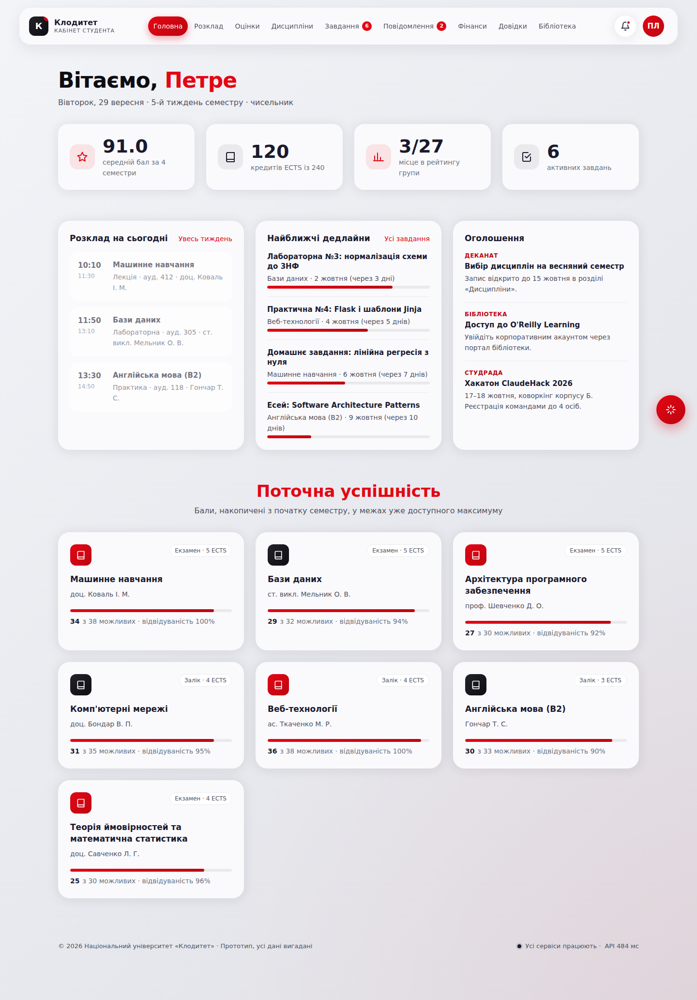
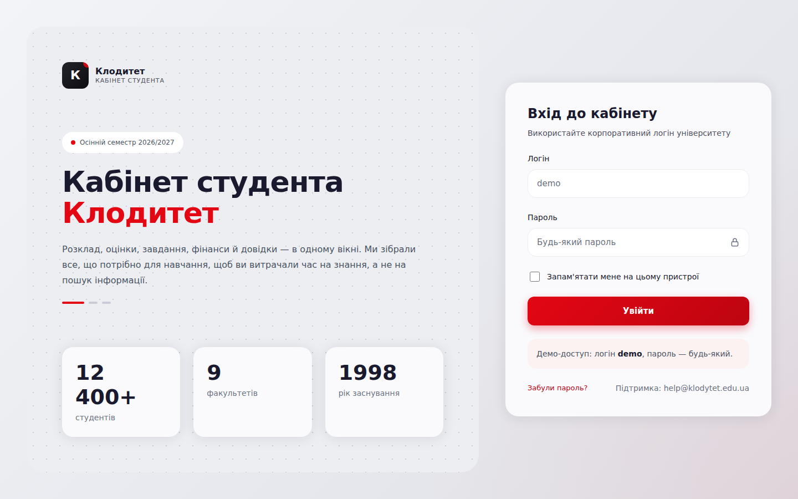
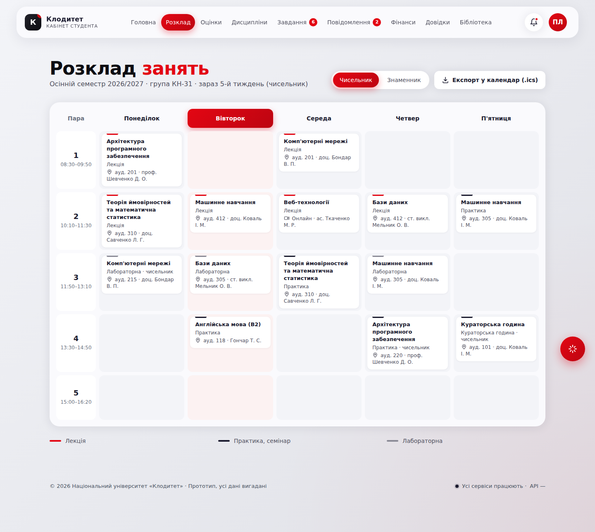
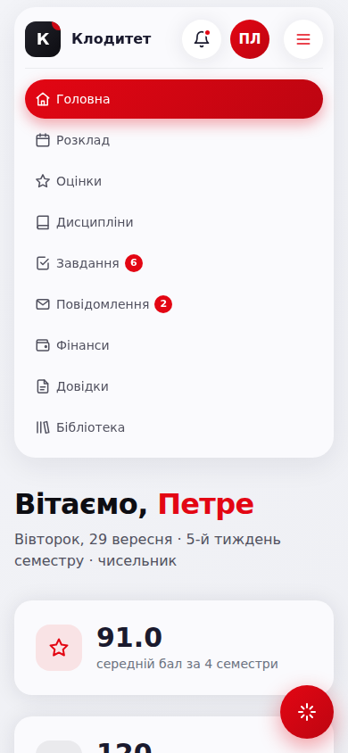

# Клодитет — кабінет студента

Прототип особистого кабінету студента в ІТ-системі університету «Клодитет».
Застосунок написано на **Flask + HTML5/CSS/JS**. Для **GitHub Pages** він збирається в статичний сайт через Frozen-Flask.

**Вхід:** логін `demo`, пароль — будь-який.



## Розділи

| Розділ | Що вміє |
|---|---|
| **Вхід** | Перевірка логіна `demo`, будь-який пароль, «Запам'ятати мене», відновлення пароля, захист сторінок від доступу без входу |
| **Головна** | Вітання, поточний тиждень (чисельник/знаменник), розклад на сьогодні з позначкою «Зараз», дедлайни, оголошення, поточна успішність |
| **Розклад** | Тижнева сітка, перемикач чисельник/знаменник, підсвічування сьогоднішнього дня й поточної пари, експорт у `.ics` для Google Calendar/Outlook |
| **Оцінки** | Залікова книжка за 4 семестри, GPA, рейтинг, **калькулятор прогнозу** балів поточного семестру, експорт у CSV, друк |
| **Дисципліни** | 7 дисциплін: модулі, контрольні точки, матеріали для завантаження, **запис на вибіркові дисципліни** (ліміт місць, підтвердження) |
| **Завдання** | Фільтри, здача робіт із завантаженням файлів (drag & drop, прогрес), чернетки, відкликання. Імітація: викладач автоматично виставляє оцінку через ~45 с |
| **Повідомлення** | Листування з викладачами та службами, пошук, нове повідомлення, індикатор набору та автовідповіді |
| **Фінанси** | Стипендія, рахунки, **демо-оплата** (без платіжних даних), квитанції, історія операцій, виписка CSV |
| **Довідки** | Замовлення 5 типів довідок; статус змінюється автоматично (Подано → В обробці → Готово), готову довідку можна завантажити як HTML |
| **Бібліотека** | Пошук і фільтри каталогу, бронювання, черга, продовження книг (до 2 разів) |
| **Профіль** | Навчальні дані, редагування контактів із валідацією, зміна пароля з індикатором надійності, налаштування сповіщень, скидання демо-даних |
| **Загальне** | Сповіщення з лічильником, лічильники в меню, **Клод-асистент** (чат-бот про розклад, дедлайни, оцінки, фінанси), адаптивна верстка, клавіатурна навігація |

## Як імітується бекенд

Сайт на GitHub Pages статичний, тому серверну частину імітує `static/js/app.js`:

- `api()` виконує дію з випадковою «мережевою» затримкою 250–750 мс (у футері видно час відповіді);
- стан користувача (здані роботи, листи, оплати, заявки, бронювання) зберігається в `localStorage` і лишається після перезавантаження;
- фонові «серверні» процеси (перевірка робіт, обробка довідок) запускаються за таймером і надсилають сповіщення.

Початкові дані лежать у `data.py`. Flask рендерить із них сторінки й передає їх у браузер як `window.SEED`.

## Запуск локально

```bash
python -m venv .venv && source .venv/bin/activate
pip install -r requirements.txt
python app.py               # http://127.0.0.1:5000
```

## Публікація на GitHub Pages

```bash
python freeze.py            # статичний сайт → ./build
```

Workflow `.github/workflows/pages.yml` збирає й публікує сайт при кожному пуші в `main`.
Щоб його ввімкнути: **Settings → Pages → Build and deployment → Source: GitHub Actions**.
Усі посилання відносні, тому сайт працює за адресою `https://<user>.github.io/<repo>/` з будь-якою назвою репозиторію.

## Структура

```
app.py                 Flask-маршрути (*.html — однакові URL у Flask і в статиці)
data.py                демо-дані: студент, дисципліни, розклад, оцінки, фінанси…
freeze.py              збірка статичного сайту (Frozen-Flask)
templates/             Jinja-шаблони сторінок
static/css/app.css     стилі (токени дизайн-системи: Inter, червоний акцент, м'які картки)
static/js/app.js       клієнтська логіка та імітація API
```

| Вхід | Розклад | Мобільна версія |
|---|---|---|
|  |  |  |

*Усі дані вигадані. Прототип створено з навчальною метою.*
